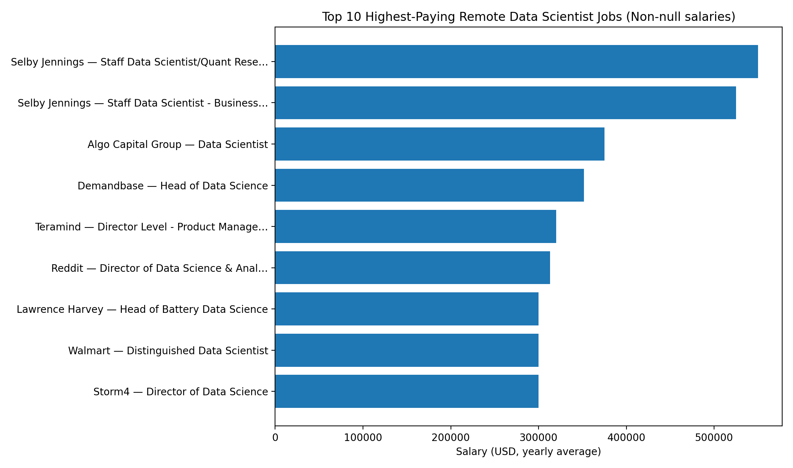
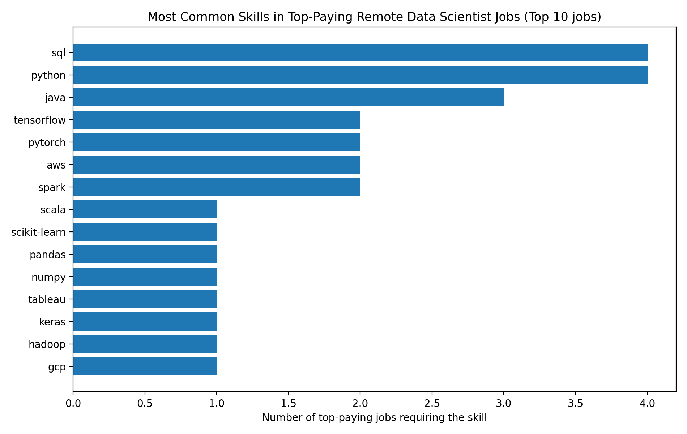
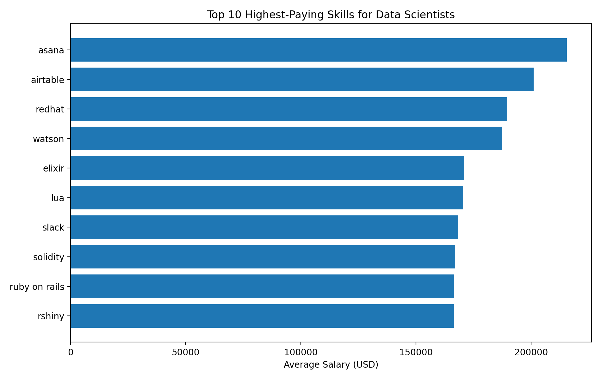
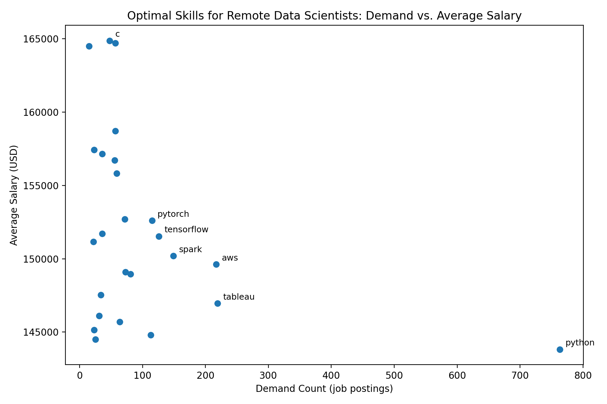

# 💼 Data Scientist Job Market Analysis (SQL)

## Introduction
📊 Dive into the Data Scientist job market!  

This project explores **💰 top-paying remote roles**, **🔥 in-demand skills**, and **📈 the intersection of high demand and high salary** for Data Scientist positions using SQL-based analysis.

🔍 **SQL queries** used in this project can be found in the `project_sql` folder:
[project_sql_folder](/project_sql/)

---

## Background
Driven by the goal of better understanding the **remote Data Scientist job market**, this project was created to identify:
- which roles offer the highest compensation,
- which skills are most frequently requested by employers,
- and which skills provide the best balance between **job security (demand)** and **financial reward (salary)**.

The dataset comes from Luke Barousse's **SQL course**, containing detailed information on job postings, including titles, salaries, locations, schedules, and required skills.

---

## Questions Answered
The analysis focuses on answering the following questions:

1. What are the top-paying remote Data Scientist jobs?
2. What skills are required for these top-paying jobs?
3. What skills are most in demand for Data Scientists?
4. Which skills are associated with higher salaries?
5. What are the most optimal skills to learn (high demand + high salary)?

---

## Tools I Used
For this analysis, the following tools were used:

- **SQL**: Core language used to query and analyze job market data.
- **PostgreSQL**: Database management system for storing and querying job postings.
- **Visual Studio Code**: Environment for writing and executing SQL queries.
- **Git & GitHub**: Version control and project sharing.

---

## 📊 The Analysis

<!-- --- -->

## 1) Top-Paying Remote Data Scientist Jobs

**Question:** What are the top-paying remote Data Scientist jobs?  
**Approach:** Filter remote roles with non-null salaries, rank by `salary_year_avg`, and select the top 10.

```sql
SELECT 
    job_id,
    job_title,
    job_title_short,
    job_location,
    job_schedule_type,
    salary_year_avg,
    job_posted_date,
    company_dim.name AS company_name
FROM job_postings_fact 
LEFT JOIN company_dim 
    ON job_postings_fact.company_id = company_dim.company_id
WHERE 
    job_title_short = 'Data Scientist'
    AND job_work_from_home = TRUE 
    AND salary_year_avg IS NOT NULL
ORDER BY salary_year_avg DESC
LIMIT 10;
```




**Key insights:**

* Salaries at the top end are extremely skewed, with the highest role reaching $550k and the next at $525k, well above the rest of the top 10.

* **Wide Salary Range:** Top 10 Data Scientist roles span from $300,000 to $550,000, indicating significant salary potential in the field.

* **Leadership and seniority dominate:** titles like Head of Data Science, Director, and Distinguished appear repeatedly, suggesting top compensation is strongly linked to senior scope.

* A few employers show up multiple times (e.g., Selby Jennings, Demandbase), indicating certain companies/recruiting pipelines cluster high-paying listings.


## 2) Skills Required for Top-Paying Remote Data Scientist Jobs

**Question:** What skills are required for the top-paying remote Data Scientist jobs?  
**Approach:** Take the top 10 highest-paying jobs from Query 1 and join with the skills tables to list required skills per role. Then aggregate skill frequency across the top jobs.
**Note:** This analysis includes only job postings that have skills listed in the dataset (jobs without skill tags are excluded due to the INNER JOIN).

```sql
WITH top_paying_jobs AS(
    SELECT 
        job_postings_fact.job_id,
        job_title,
        salary_year_avg,
        name AS company_name
        

    FROM job_postings_fact 
    LEFT JOIN company_dim ON job_postings_fact.company_id = company_dim.company_id

    WHERE 
        job_title_short = 'Data Scientist'
        AND job_location = 'Anywhere' 
        AND job_work_from_home = TRUE 
        AND salary_year_avg IS NOT NULL
    ORDER BY  salary_year_avg DESC
    LIMIT 10

)

SELECT 
    top_paying_jobs.*,
    skills_dim.skills AS skill_name

FROM top_paying_jobs
INNER JOIN skills_job_dim ON skills_job_dim.job_id = top_paying_jobs.job_id
INNER JOIN skills_dim ON skills_dim.skill_id = skills_job_dim.skill_id
ORDER BY salary_year_avg DESC
```




**Key insights:**

* Among the top-paying jobs that list skills, **SQL** and **Python** are the most recurrent, appearing across multiple high-salary postings.

* There’s a strong production / big-data flavor in the skill mix (e.g., **Java**, **Spark**), which suggests these top-paying “Data Scientist” roles often overlap with data engineering / scalable ML systems.

* Deep learning + cloud show up as differentiators (**TensorFlow/PyTorch, AWS/Azure/GCP**), hinting that high compensation often correlates with deployment-ready, modern stacks.


## 3) Most In-Demand Skills for Data Scientists

**Question:** What are the most in-demand skills for Data Scientists?  
**Approach:** Join job postings with the skills tables, count distinct job postings per skill, and rank the top 5 by demand.

```sql
SELECT 
    
    skills_dim.skills AS skill_name,
    COUNT(DISTINCT job_postings_fact.job_id) AS demand_count
FROM job_postings_fact
INNER JOIN skills_job_dim ON skills_job_dim.job_id = job_postings_fact.job_id
INNER JOIN skills_dim ON skills_dim.skill_id = skills_job_dim.skill_id
WHERE job_postings_fact.job_title_short = 'Data Scientist' 
GROUP BY skills_dim.skills 
ORDER BY demand_count DESC
LIMIT 5
```


**Most in-demand skills for Data Scientists in 2023**

**Key Insights:**

* **Python** and **SQL** clearly dominate the market, confirming them as the core foundation for Data Scientist roles. Their high demand reflects the need for both data manipulation and end-to-end analytical workflows.

* **R** remains highly relevant, indicating continued demand for statistical analysis and research-oriented data science tasks.

* Cloud and visualization tools, such as **AWS** and **Tableau**, appear among the top skills, highlighting the growing importance of deploying models at scale and effectively communicating insights.


| Skill     | Demand Count |
|----------:|-------------:|
| Python    | 114,016      |
| SQL       | 79,174       |
| R         | 59,754       |
| Tableau   | 29,513       |
| AWS       | 26,311       |


## 4) Top Skills Based on Average Salary (Data Scientists)

**Question:** What skills are associated with the highest average salaries for Data Scientists?  
**Approach:** Join job postings with skills, calculate the average annual salary per skill, and rank the top 10 skills by average salary. Only roles with specified salaries are included.



**Key Insights:**

* The top-paying skills are often specialized or niche tools (e.g., **Asana**, **Airtable**, **Slack**, **RedHat**), which typically appear in a small number of highly compensated roles.

* High average salary does not necessarily imply high demand; many of these skills are rare in the dataset but linked to senior, leadership, or platform-heavy roles.

* This suggests that salary premiums are driven by specialization and context, rather than by universally required Data Scientist skills.

***These results should be interpreted alongside demand metrics, as some high-paying skills appear in only a limited number of job postings.***

## 5) Most Optimal Skills (High Demand + High Salary)

**Question:** What are the most optimal skills to learn for remote Data Scientist roles (high demand and high-paying)?  
**Approach:** For remote Data Scientist postings with non-null salaries, calculate:
- `demand_count` = number of postings requiring each skill  
- `avg_salary` = average salary for postings requiring the skill  
Then filter to skills with meaningful demand (e.g., > 10 postings) and rank the top skills.




**Here’s the breakdown of the most “optimal” skills (high demand + strong salary) for remote Data Scientist roles:**

* **Python** stands out as the most in-demand skill by far (763 postings) while still maintaining a strong average salary (~$143.8k), making it the most reliable foundational investment.

* Cloud + big-data tooling clusters in the high-demand, high-salary region, including **AWS**, **Spark**, **Snowflake**, and **GCP**, suggesting production-scale data skills correlate strongly with compensation.

* ML frameworks and core libraries (e.g., **TensorFlow**, **PyTorch**, **scikit-learn**, **NumPy**, **pandas**) show solid demand and competitive salaries, reinforcing that modern DS roles blend modeling skills with engineering readiness.


## 📘 What I Learned

Working on this project helped me strengthen both my **SQL skills** and my ability to **analyze and communicate data insights**. Key takeaways include:

- How to structure SQL queries around **clear analytical questions** instead of isolated calculations.
- Practical use of **CTEs, joins, aggregations, and filtering** to explore real-world datasets.
- The importance of combining **demand and salary metrics** to avoid misleading conclusions.
- How niche skills can inflate average salaries and why **context and demand matter** when interpreting results.
- Translating query results into **clear insights and visualizations** suitable for a professional portfolio.


## 🔚 Final Conclusions

* Top-paying Data Scientist roles are closely tied to seniority and system-level responsibility.

* Foundational skills (Python, SQL) are essential at all levels.

* Specialization and production readiness drive salary premiums.

* The optimal career strategy combines strong fundamentals with targeted specialization.

## Closing Thoughts

This project strengthened my SQL skills while providing practical insights into the Data Scientist job market. The analysis highlights how salary, demand, and skill specialization interact, showing that the most effective career strategies combine strong fundamentals with targeted specialization.

By focusing on high-demand and high-paying skills, this project offers a data-driven perspective on skill prioritization and career planning. Overall, it reinforces the importance of continuous learning and adaptability in a rapidly evolving data science landscape.
